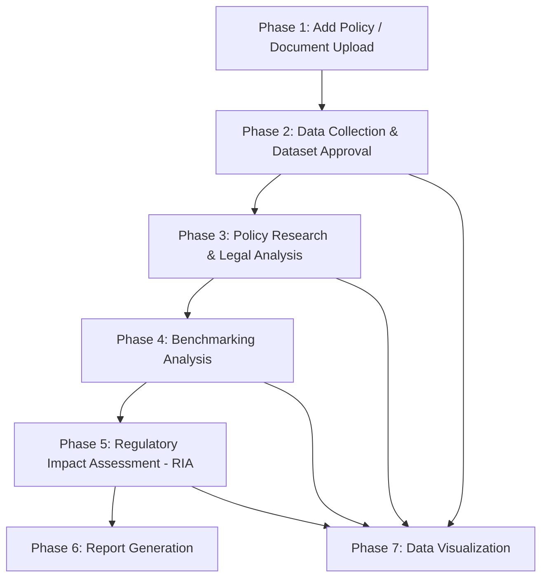

# Legislative Research & Policy Development System (Cap2)
## Project Process, Workflows & Gemini AI Token Optimization Guide

---

## 1. Project Overview & Objective

The **Legislative Research & Policy Development System** (`Cap2` / `Legislative_research`) is an AI-enhanced civic governance platform designed for local government units (specifically tailored for **San Jose Del Monte, Bulacan, Philippines**).

### Core Objective
To assist legislative researchers, council members (Sanggunian), and policy analysts in:
- Ingesting, parsing, and analyzing local policy proposals and ordinances.
- Mapping proposed policies against the hierarchy of Philippine National Laws (Republic Acts, Executive Orders, Presidential Decrees) and existing local ordinances.
- Automating comparative analysis, legal harmonization, and monitoring frameworks.
- Conducting cross-jurisdictional benchmarking and Regulatory Impact Assessments (RIA).
- Generating comprehensive, publish-ready legislative research reports and policy briefs.

---

## 2. End-to-End System Workflow Architecture

The application operates as a 7-phase sequential and interconnected workflow pipeline:



### Phase Breakdown

#### Phase 1: Policy Ingestion & Initial Parsing
- **Key Modules**: [`modules/add-policy.php`](file:///opt/lampp/htdocs/cap2/modules/add-policy.php), [`includes/FileAnalyzer.php`](file:///opt/lampp/htdocs/cap2/includes/FileAnalyzer.php)
- **Workflow**:
  1. User uploads a policy document (`.pdf`, `.docx`, `.txt`) or manually inputs policy title, description, category, and objectives.
  2. `FileAnalyzer.php` extracts raw text from document files (using custom regex parsers for PDF/DOCX).
  3. Extracted text undergoes preliminary rule-based extraction (keyword analysis, risk assessment, and basic local ordinance matching).
  4. Record is saved into the `policy_documents` database table with status `Pending`.

#### Phase 2: Data Collection & Automated Legal Mapping
- **Key Modules**: [`modules/data-collection.php`](file:///opt/lampp/htdocs/cap2/modules/data-collection.php)
- **Workflow**:
  1. Researchers submit demographic, environmental, health, or economic datasets related to the policy.
  2. Administrative review approves or rejects datasets.
  3. **AI Trigger**: Upon approval, `generateSupportingDocumentsWithGemini()` is invoked to generate 6 structured legal framework documents:
     - Comparative Analysis
     - Harmonization Recommendations
     - Legal Framework Mapping
     - Implementation Recommendations
     - Monitoring and Evaluation Framework
     - Policy Recommendations
  4. Automatically initializes a corresponding **Impact Assessment** record in the database.

#### Phase 3: Policy Research & Deep Legal Analysis
- **Key Modules**: [`modules/policy-research.php`](file:///opt/lampp/htdocs/cap2/modules/policy-research.php)
- **Workflow**:
  1. Researchers perform in-depth analysis of policy drafts against national laws (e.g., RA 7160 - Local Government Code, RA 9003, etc.) and SJDM local ordinances.
  2. AI extracts legal citations, evaluates hierarchy of laws, and detects legal gaps or conflicts.
  3. Interactive category search retrieves aligned national legal precedents.

#### Phase 4: Cross-Jurisdictional Benchmarking Analysis
- **Key Modules**: [`modules/benchmarking-analysis.php`](file:///opt/lampp/htdocs/cap2/modules/benchmarking-analysis.php)
- **Workflow**:
  1. Compares proposed local policy against ordinances adopted by other Local Government Units (LGUs) in the Philippines or international best practices.
  2. Evaluates success metrics, adoption feasibility, and localized adjustments needed for SJDM.

#### Phase 5: Regulatory Impact Assessment (RIA)
- **Key Modules**: [`modules/impact-assessment.php`](file:///opt/lampp/htdocs/cap2/modules/impact-assessment.php)
- **Workflow**:
  1. Conducts quantitative and qualitative evaluation across multiple impact vectors:
     - Social & Community Impact
     - Economic & Business Impact
     - Environmental Sustainability Impact
     - Administrative & Institutional Feasibility
  2. Calculates composite risk scores, estimates implementation costs, and suggests risk mitigation protocols.

#### Phase 6: Report Generation & Legislative Briefings
- **Key Modules**: [`modules/report-generation.php`](file:///opt/lampp/htdocs/cap2/modules/report-generation.php)
- **Workflow**:
  1. Aggregates data from Phase 1 through Phase 5 into a single, standardized legislative report.
  2. Generates Executive Summaries, Ordinance Draft Templates, and Monitoring Checklists.
  3. Supports exporting to PDF, DOCX, or web printable formats.

#### Phase 7: Data Analytics & Visualization
- **Key Modules**: [`modules/data-visualization.php`](file:///opt/lampp/htdocs/cap2/modules/data-visualization.php)
- **Workflow**:
  1. Generates interactive charts (Chart.js / Tailwind CSS) reflecting policy category distributions, dataset metrics, impact scores, and research completion status.

---

## 3. Current Gemini AI API Architecture Breakdown

The project integrates Google's **Gemini AI API** through two gateways:
1. **PHP Direct REST cURL Gateway**: [`includes/gemini_helper.php`](file:///opt/lampp/htdocs/cap2/includes/gemini_helper.php) calling `https://generativelanguage.googleapis.com/v1beta/models/{GEMINI_MODEL}:generateContent`.
2. **Node.js Express/HTTP Bridge**: [`nodejs/bridge.js`](file:///opt/lampp/htdocs/cap2/nodejs/bridge.js) running on `http://localhost:3000`.

### Current Configuration Settings (`config/.env` & `config/config.php`)
- **Default Model**: `gemini-3.5-flash-lite` (or `gemini-1.5-flash` / `gemini-2.0-flash`)
- **Max Output Tokens**: `2048` to `4096`
- **Temperature**: `0.3` (keyword extraction) to `0.7` (general analysis)

---

## 4. Identified Token Consumption Bottlenecks & Rate Limit Risks

As the project utilizes **Gemini's Free Tier API**, it is bound by strict rate limits:
- **15 Requests Per Minute (RPM)**
- **1,000,000 Tokens Per Minute (TPM)**
- **1,500 Requests Per Day (RPD)**

### Current Wasteful Consumption Patterns Identified in Code:

```
[ Dataset Approval Triggered ]
   ├── API Call 1: Health Check ("ping") -----------------> Wasteful Ping
   ├── API Call 2: Comparative Analysis ------------------> Repeated Context
   ├── API Call 3: Harmonization Recommendations ---------> Repeated Context
   ├── API Call 4: Legal Framework Mapping --------------> Repeated Context
   ├── API Call 5: Implementation Recommendations -------> Repeated Context
   ├── API Call 6: Monitoring & Evaluation -------------> Repeated Context
   └── API Call 7: Recommendations -----------------------> Repeated Context
Total: 7 API Calls per single dataset approval!
```

1. **Unnecessary "Ping" Calls on Every Page Load**:
   - In [`data-collection.php`](file:///opt/lampp/htdocs/cap2/modules/data-collection.php#L813) & [`policy-research.php`](file:///opt/lampp/htdocs/cap2/modules/policy-research.php#L443), `$test_response = callGeminiAPI("ping");` is called every time a user refreshes the page or approves a dataset just to display a UI status badge ("Connected").
   - **Impact**: Consumes up to 10-30 requests per user session purely for status checks.

2. **Explosive Batching (7 Calls per Dataset Approval)**:
   - In `generateSupportingDocumentsWithGemini()`, approving 1 dataset runs a loop generating 6 separate legal documents via 6 distinct cURL calls, plus 1 health-check ping call.
   - Each call re-transmits the identical Dataset Name, Category, Description, and SJDM prompt headers.
   - **Impact**: Approving just **2 datasets back-to-back** exceeds the Free Tier's 15 RPM limit, causing HTTP 429 Rate Limit errors.

3. **Absence of Database / Session Caching**:
   - AI responses are saved as output text, but prompt-response hashes are not cached. Re-running research or refreshing pages re-issues full AI generation calls.

4. **Excessive Output Token Limits for Simple Tasks**:
   - `extractKeywords()` in [`policy-research.php`](file:///opt/lampp/htdocs/cap2/modules/policy-research.php#L280) asks for 5-10 words, yet sets `maxOutputTokens` to `500`.
   - Default output token limits across `gemini_helper.php` default to `2048` or `4096`.

5. **Uncompressed Raw File Text Transfers**:
   - Extracting 20-page document texts and injecting them directly into prompts consumes tens of thousands of input tokens unnecessarily.

---

## 5. Strategic Recommendations for Token & Rate Limit Optimization

To ensure seamless operation within Gemini's Free Tier, implement these 6 architectural recommendations:

### Recommendation 1: Consolidate Multi-Document Generation into a Single Call (6 Calls -> 1 Call)
Instead of executing 6 separate API requests for 6 supporting document types, send **1 single prompt** requesting a structured JSON object containing all 6 sections.

#### Token Savings: **~80% reduction in API calls and input tokens** (7 calls down to 1).

**Optimized Single-Pass Prompt Pattern**:
```json
{
  "comparative_analysis": "...",
  "harmonization": "...",
  "legal_mapping": "...",
  "implementation": "...",
  "monitoring_evaluation": "...",
  "recommendations": "..."
}
```

---

### Recommendation 2: Eliminate Token-Consuming Health Checks (Local Transient Checking)
Remove `callGeminiAPI("ping")` on page load. Replace it with:
1. **Local Bridge Check**: Check if Node.js port 3000 / cURL destination is reachable locally without sending text to Gemini.
2. **Transient Session Caching**: Cache the status check in `$_SESSION['gemini_status']` for 10-15 minutes instead of firing on every page load.

#### Token Savings: **Saves 100% of status-check token consumption**.

---

### Recommendation 3: Implement Database Response Caching (`ai_cache` Table)
Before dispatching any API call to Gemini, compute an MD5 hash of the input prompt (`md5($prompt)`). Check if a non-expired response exists in a local cache table.

#### Database Schema (`ai_cache`):
```sql
CREATE TABLE IF NOT EXISTS ai_cache (
    cache_id INT AUTO_INCREMENT PRIMARY KEY,
    prompt_hash VARCHAR(32) UNIQUE NOT NULL,
    response_text TEXT NOT NULL,
    created_at DATETIME DEFAULT CURRENT_TIMESTAMP,
    INDEX(prompt_hash)
);
```

#### PHP Caching Logic:
```php
function callGeminiAPIWithCache($prompt, $temperature = 0.7, $maxTokens = 2048) {
    $conn = getDBConnection();
    $hash = md5($prompt . '_' . $temperature . '_' . $maxTokens);
    
    // Check Cache
    $stmt = $conn->prepare("SELECT response_text FROM ai_cache WHERE prompt_hash = ? AND created_at > NOW() - INTERVAL 7 DAY");
    $stmt->bind_param("s", $hash);
    $stmt->execute();
    $res = $stmt->get_result();
    if ($row = $res->fetch_assoc()) {
        return $row['response_text']; // 0 API tokens consumed!
    }
    
    // Call API if not cached
    $response = callGeminiAPI($prompt, $temperature, $maxTokens);
    if ($response) {
        $saveStmt = $conn->prepare("INSERT INTO ai_cache (prompt_hash, response_text) VALUES (?, ?) ON DUPLICATE KEY UPDATE response_text = VALUES(response_text)");
        $saveStmt->bind_param("ss", $hash, $response);
        $saveStmt->execute();
    }
    return $response;
}
```

---

### Recommendation 4: Right-Size `maxOutputTokens` & Trim Context Length
Tailor `maxTokens` strictly to the expected output size:

| Task Type | Current `maxTokens` | Recommended `maxTokens` | Savings |
| :--- | :--- | :--- | :--- |
| Keyword Extraction (`extractKeywords`) | `500` | `60 - 100` | 80% output token cap |
| Short Legal Citation Match | `4096` | `512` | 87% output token cap |
| Single Document Analysis | `4096` | `1500` | 63% output token cap |
| Consolidated 6-in-1 Report | N/A | `3000` | Single combined pass |

#### Text Truncation Utility:
Limit input prompt text to a maximum character length (e.g., first 3,000 words or ~12,000 characters) before sending to Gemini:
```php
$truncated_description = substr($description, 0, 4000);
```

---

### Recommendation 5: Hybrid Rule-Based NLP First, AI Second
Utilize [`FileAnalyzer.php`](file:///opt/lampp/htdocs/cap2/includes/FileAnalyzer.php) local PHP functions (`extractKeywords()`, `findSimilarOrdinances()`, `generateLegalCitations()`) for immediate basic parsing. Call Gemini API **only when** deep synthesis or complex reasoning is requested by the user.

---

### Recommendation 6: Client-Side Rate Limiting & Debouncing
- Disable submission buttons while AI requests are in-flight (`disabled` state with loading spinner).
- Add a 2-second client-side delay/queue for bulk operations to stay well within Gemini's **15 Requests Per Minute (RPM)** threshold.

---

## 6. Summary Comparison: Before vs. After Optimization

| Metric | Before Optimization | After Optimization | Improvement |
| :--- | :--- | :--- | :--- |
| **API Calls per Dataset Approval** | 7 Requests | 1 Request | **85% Fewer Requests** |
| **Page Refresh Health Checks** | 1 Request per refresh | 0 (Cached/Local Port check) | **100% Eliminated** |
| **Repeated Prompt Cost** | Full token charge every time | 0 Tokens (Served from DB Cache) | **100% Saved on Repeats** |
| **Risk of HTTP 429 Rate Limit** | Very High (Exceeds 15 RPM easily) | Minimal / Negligible | **Free Tier Compliant** |
| **Average Response Time** | ~15 - 25 seconds | ~3 - 5 seconds | **5x Faster Output** |

---
*Documentation generated for Legislative Research Project (`cap2`).*
